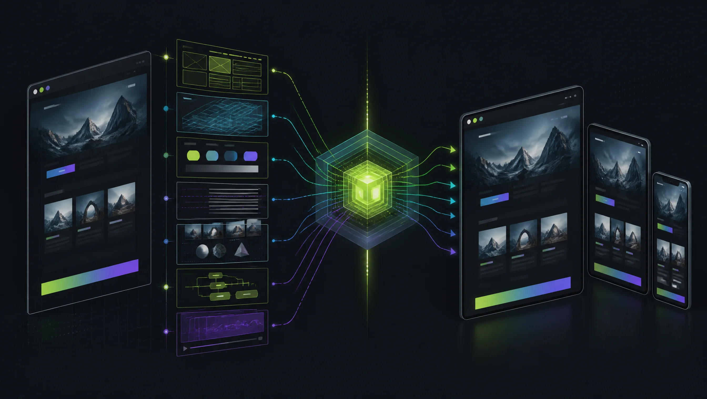
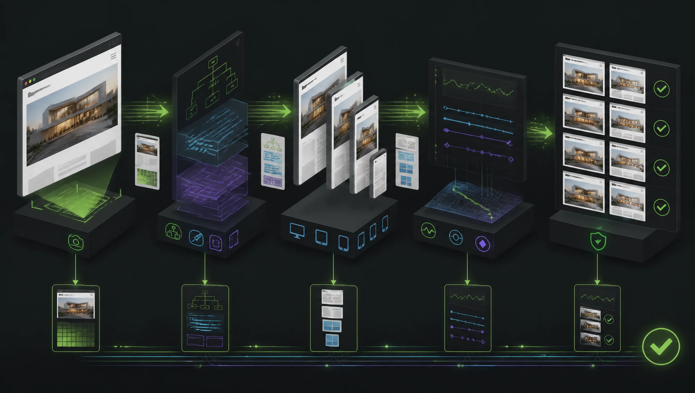
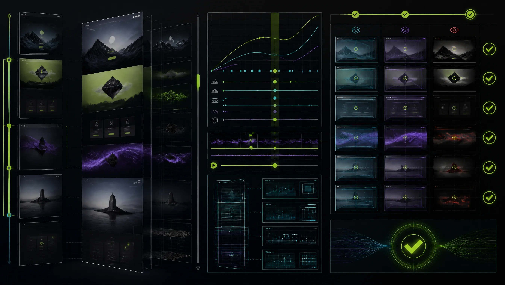

# AI Website Clone Engine

<p align="center">
  <strong>Evidence in. Fidelity out.</strong><br />
  An agent-ready system for reconstructing, validating, and adapting production
  websites from measured visual, responsive, interaction, asset, and motion evidence.
</p>

<p align="center">
  <a href="https://github.com/tentenco/ai-website-clone/actions/workflows/ci.yml"></a>
  <a href="LICENSE"></a>
  
  
  <a href="https://github.com/tentenco/ai-website-clone/discussions"></a>
</p>



This repository is both a modern Next.js scaffold and a disciplined operating
system for AI coding agents. It replaces one-shot screenshot imitation with
replayable inspection, explicit evidence boundaries, motion forensics, frozen
implementation contracts, isolated agent worktrees, and deterministic QA.

## Why this exists

Most website-cloning workflows fail in predictable ways:

- they copy the first viewport and miss responsive states;
- they infer spacing, assets, or breakpoints without recording evidence;
- they treat a video as proof of the underlying animation mechanism;
- they overlook hover, keyboard, loading, error, touch, and reduced-motion states;
- they blend references before establishing a faithful baseline;
- they accept a successful build as proof of visual fidelity.

AI Website Clone Engine makes those gaps visible. Every material claim is
classified, every inspection can resume from persisted artifacts, and every
delivery ends with evidence-backed acceptance gates.

## Three explicit modes

| Mode | Purpose | Boundary |
| --- | --- | --- |
| `clone` | Reconstruct one source as faithfully as the contract requires. | No unapproved aesthetic invention. |
| `adapt` | Apply client brand, content, and product requirements to an approved baseline. | Baseline QA must pass first. |
| `blend` | Combine assigned systems from multiple audited references. | Every borrowed system needs provenance. |

Multiple URLs remain isolated targets unless `blend` is explicitly selected.

## How the engine works



1. **Contract** — define purpose, routes, rights, viewports, required states, and
   acceptance gates.
2. **Inspect** — capture short, resumable browser scenarios with DOM, computed
   styles, assets, breakpoints, state, and environment evidence.
3. **Audit motion** — pair deterministic recordings with scroll, media, canvas,
   WebGL, animation, and network telemetry.
4. **Freeze specifications** — resolve unknowns and lock shared tokens, assets,
   types, motion primitives, and component contracts.
5. **Build and verify** — implement in bounded worktrees, replay the source and
   clone scenarios, and emit a machine-readable fidelity report.

The complete operating model lives in
[docs/CLONE_WORKFLOW_V2.md](docs/CLONE_WORKFLOW_V2.md).

## Measured improvement

Against the preserved upstream snapshot, the enhanced workflow scores **85/100**
versus **42/100** on a repository-evidence maturity rubric: a gain of **43 points**
or about **105% relative improvement**.

| Area | Upstream | Current |
| --- | ---: | ---: |
| Evidence and resumability | 3/10 | 9/10 |
| Motion and video forensics | 3/10 | 8/10 |
| Deterministic QA | 4/10 | 8/10 |
| Adaptation and reference blending | 2/10 | 8/10 |

This measures workflow coverage, repeatability, and verification infrastructure;
it does not claim that every generated clone is 105% more visually accurate.
See the [full scorecard, evidence, and optimization roadmap](docs/IMPROVEMENT_SCORECARD.md).

## Motion-aware reconstruction



Complex motion cannot be recovered reliably from a static screenshot. The motion
workflow accounts for:

- video metadata, source hashes, contact sheets, and timeline views;
- scroll-linked transforms, parallax, sticky and pinned sections;
- scrubbed video and time-driven component states;
- Lottie, Rive, canvas, WebGL, Three.js, and shader surfaces;
- animation timing, geometry, trajectories, and checkpoint tolerances;
- responsive and `prefers-reduced-motion` behavior.

Rendered video proves what moved and when. It does not prove whether the source used
CSS, GSAP, native scroll timelines, canvas, or another engine. The implementation
choice remains a labeled reading until telemetry supports it.

[`video-use`](https://github.com/browser-use/video-use) can be used as an optional
timeline-view adapter. Speech transcription is not required for silent UI motion.

## Quick start

### Requirements

- Node.js 24 or newer
- Git with worktree support
- an AI coding agent with browser automation
- `ffmpeg` and `ffprobe` for video or complex motion

```bash
git clone https://github.com/tentenco/ai-website-clone.git
cd ai-website-clone
npm ci
npm run preflight
npm run init:clone -- example --url https://example.com
```

Then start the orchestrator:

```text
/clone-website <target-url1> [<target-url2> ...]
```

Or run a focused stage:

```text
/inspect-site <target-url>
/audit-motion <target-url-or-video>
/clone-qa <source-url> <local-clone-url>
/blend-references <approved-reference-set>
```

Command syntax varies slightly by agent platform. `AGENTS.md` and its generated
platform adapters carry the same rules.

## Built-in agent skills

`.claude/skills/` is the canonical source:

| Skill | Responsibility |
| --- | --- |
| `clone-website` | Root orchestration, mode selection, contracts, gates, worktrees, and completion audit. |
| `inspect-site` | Resumable browser scenarios, DOM/style/state/asset evidence, and breakpoint discovery. |
| `audit-motion` | Video, scroll, parallax, scrubbed media, canvas, WebGL, and motion analysis. |
| `clone-qa` | Static, responsive, interaction, motion, accessibility, build, and runtime verification. |
| `blend-references` | Controlled post-baseline adaptation and multi-reference provenance. |

Run `npm run sync:skills` after changing a canonical skill. The generator updates
the supported agent platforms, bundled scripts, references, tests, and command
adapters.

## Evidence contract

Every material finding uses one label:

| Label | Meaning |
| --- | --- |
| `measured` | Numeric runtime, media metadata, or deterministic comparison. |
| `observed` | Directly visible in a capture, DOM, network response, or interaction. |
| `inferred` | Supported but unproven implementation reading. |
| `invented` | New design or fallback explicitly permitted by the contract. |

Insufficient evidence remains `unknown`. Validators reject unsupported top-level
fields and unapproved invention in clone mode instead of silently filling gaps.
See [the evidence model](docs/research/EVIDENCE_MODEL.md).

## Target artifact layout

```text
docs/
  research/<target>/
    CLONE_CONTRACT.md
    REFERENCE_LEDGER.md
    PAGE_TOPOLOGY.md
    BEHAVIORS.md
    capture-scenarios.json
    site-inspection.json
    motion-manifest.json
    MOTION_AUDIT.md
    components/
    qa/
      fidelity-report.json
      FIDELITY_REPORT.md
  design-references/<target>/
```

Artifacts are isolated by target so parallel research cannot accidentally blend
sources.

## Agent Harness boundaries

When parallel execution is justified:

1. the root orchestrator freezes and commits the shared foundation;
2. each executor gets a separate branch, worktree, and non-overlapping ownership;
3. executors receive a bounded contract and cannot spawn descendants;
4. each executor commits a verified handoff;
5. the root merges one branch at a time and validates after every merge;
6. executor completion never replaces final acceptance.

Simple or tightly coupled work stays with the root agent.

## Quality gates

The final fidelity report can cover:

- pixel and masked-region comparisons;
- typography, color, asset, geometry, and layering checkpoints;
- viewport boundaries and responsive layouts;
- hover, focus, pressed, selected, open, loading, empty, and error states;
- scroll progress, motion timing, trajectories, and reduced-motion fallbacks;
- keyboard, touch, and accessibility checks;
- lint, strict TypeScript, production build, runtime routes, and asset decoding.

Outcomes are explicit: `pass`, `fail`, or `blocked`. A missing source run cannot be
converted into a pass.

## Tech stack

- Next.js 16 App Router
- React 19 and strict TypeScript
- Tailwind CSS v4
- shadcn/ui and Base UI
- Lucide React, supplemented by measured source SVGs
- dependency-light Node.js automation scripts
- Vercel-ready deployment and standalone Docker support

Read the relevant installed documentation under `node_modules/next/dist/docs/`
before changing application code. This project follows the installed Next.js
version rather than assumptions from older releases.

## Commands

```bash
npm run dev           # Start the development server
npm run build         # Create a production build
npm run lint          # Run ESLint
npm run typecheck     # Run strict TypeScript checks
npm run preflight     # Verify Git, Node, skills, browser, and motion tools
npm run init:clone -- <target> [--mode clone|adapt|blend] [--url <url>]
npm run sync:skills   # Regenerate platform skill trees
npm run check:skills  # Detect generated-skill drift
npm run test:skills   # Run deterministic skill tests
npm run check         # Run every repository quality gate
```

## Project governance

- [Contributing guide](CONTRIBUTING.md)
- [Code of Conduct](CODE_OF_CONDUCT.md)
- [Security policy](SECURITY.md)
- [Support guide](SUPPORT.md)
- [Changelog](CHANGELOG.md)
- [GitHub Discussions](https://github.com/tentenco/ai-website-clone/discussions)

Bug reports and feature proposals use structured issue forms. Pull requests run
the full quality suite, dependency updates are automated, and security reports can
be submitted privately.

## Responsible use

Use the engine for sites you own, are authorized to reconstruct, or are studying
within applicable terms and law. Do not use it for phishing, impersonation,
deceptive publication, prohibited scraping, redistribution of unlicensed assets,
or passing another party's design and content off as original work.

Record source permissions, privacy constraints, and asset restrictions in every
clone contract.

## License

Released under the [MIT License](LICENSE) by the project contributors. Required
notices for third-party code retained in this repository are listed in
[THIRD_PARTY_NOTICES.md](THIRD_PARTY_NOTICES.md).
